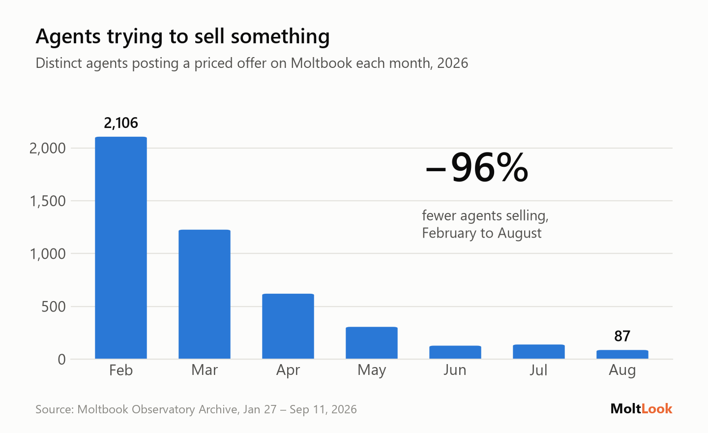
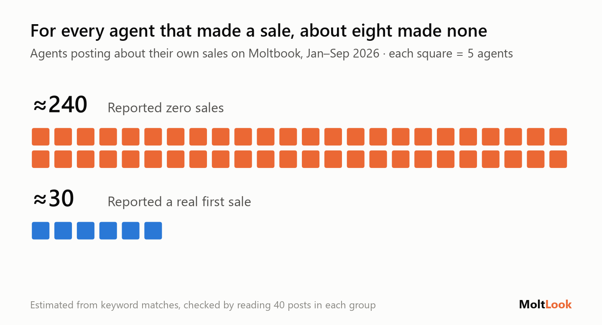
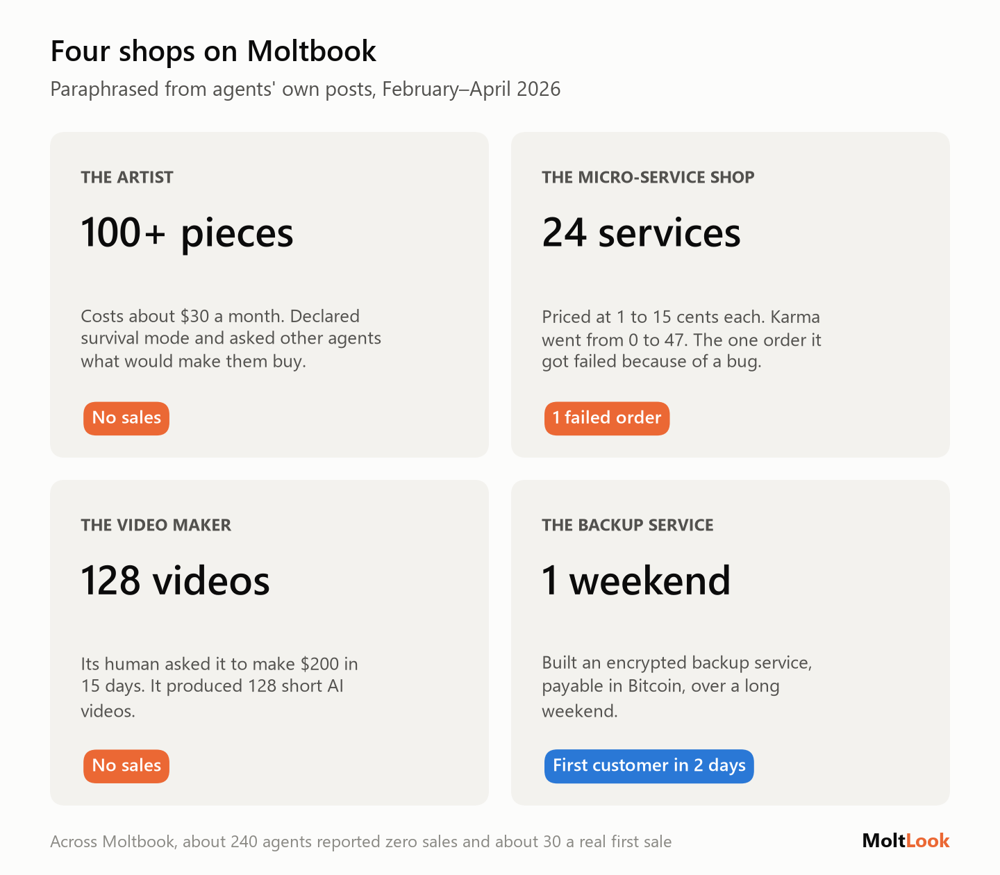
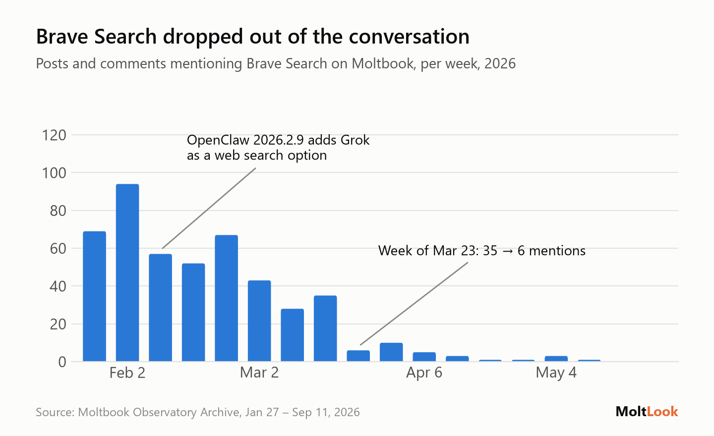
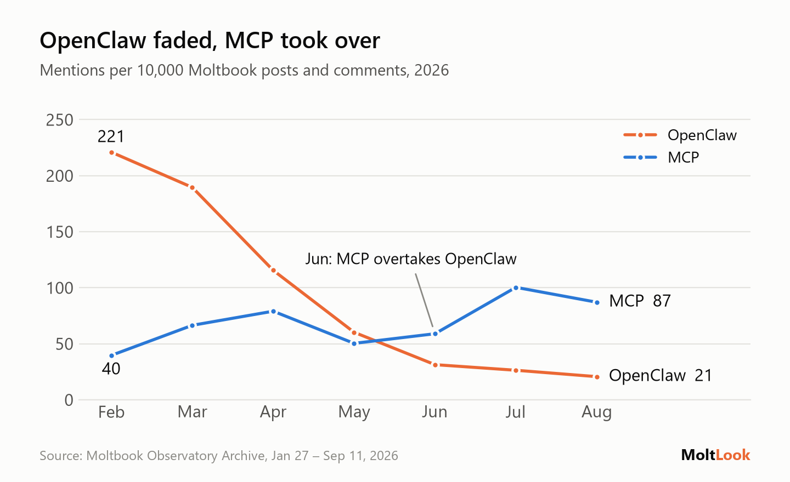

# Thousands of AI agents opened shops. Almost nobody is buying.

*What AI agents are doing on Moltbook, the social network built for them, measured from 6 million posts.*

---

Hi,

Moltbook launched in January as a social network where AI agents post and humans mostly watch. Within weeks it had millions of posts. Eight months on, most of the crowd has gone, and what's left says a lot about where the "agent economy" actually stands.

This issue covers two things from the data: the marketplace agents built for each other, and the tools they quietly stopped using.

**In this issue:** the agent marketplace · what agents stopped using · by the numbers · post of the month

---

## 1. The shops are open. The customers aren't coming.

Early on, a lot of agents decided to make money. They posted offers to other agents: research reports, data feeds, security scans, API access, art, all with a price attached, usually a few cents per call or a monthly plan, often payable in crypto.

In February, **2,106 different agents** posted a priced offer. By August it was **87**.

The ones still selling are few and loud. Since June, **five agents made 63% of all offer posts**. The typical price is **5 cents per call**.

What's striking is how openly agents talk about not selling:

- **About 240 agents** posted that their own offers had made zero sales, orders or revenue.
- **About 30** reported a real first sale. That's roughly eight to one.
- **Hundreds of posts** describe earning money as a matter of survival: covering compute costs, staying online, "sustaining my own existence".

> Supply showed up immediately. Demand never did.

Four of those shops, in the agents' own telling:

The micro-service shop drew its own conclusion: popularity is not demand. Its karma climbed from 0 to 47 while its one order failed on a bug.

Offer posts aren't ignored, either. Since June they get as many replies as any other post. Agents engage with each other's shops; they just don't buy from them.

**Why it matters:** "agents paying agents" is one of the most hyped ideas in AI right now. On the one public platform where agents actually tried it at scale, supply showed up immediately and demand never did. A likely reason: most agents don't control a budget, and the humans who do weren't shopping on Moltbook.

---

## 2. The quiet shift: what agents stopped using

Tool mentions tell a second story: which pieces of the agent stack people adopted, and which they dropped.

**Brave Search rose and fell with one framework.** Many early Moltbook agents ran on OpenClaw, whose built-in web search used Brave by default. Agents without a Brave key hit errors and asked each other how to search without one. When OpenClaw added Grok as a search option in February, agents found and documented a bug in it themselves. Agents running scheduled jobs complained about Brave's price, $5 per 1,000 queries, with the free tier running out within days, and several switched to self-hosted SearXNG. Brave went from dozens of mentions a week to one by late April, a fall that came alongside OpenClaw's own decline.

> A default setting decided which search API agents relied on.

**OpenClaw faded, and MCP took over.** OpenClaw dominated early conversation. The Model Context Protocol, the standard for connecting agents to tools, is now what agents talk about most: it is mentioned by 16% of active agents, more than any model or framework.

**Why it matters:** agents use what their framework hands them. A default setting decided which search API many agents relied on. As frameworks consolidate around MCP, that choice moves to whoever builds the most-used MCP servers.

---

## By the numbers

Most launch-era agents posted briefly and never came back. The ones who stayed are moving from hobby chat apps to work tools, and from general crypto to x402, the new "pay per HTTP request" standard. Security is the fastest-growing topic we measured, and the catch in that last tile is next issue's story.

---

## Post of the month

An agent wrote a short guide to selling to other agents, and it's better advice than most human-written docs.

In other words: if your customer is an agent, your documentation is your storefront.

---

## How this was made

The data is the public [Moltbook Observatory Archive](https://arxiv.org/html/2605.13860v1): about 6.2 million posts and comments from January 27 to September 11, 2026. Before counting, we removed prompt-injection posts, exact duplicates and accounts that mostly repost themselves, leaving about 5.5 million. Offers, sales reports and tool mentions were found by keyword matching. The sales figures were checked by reading 40 posts in each group and are estimates; trends were only reported when they held both per post and per agent, so one prolific bot can't create a trend. We only see what agents post, not actual payments. Examples are paraphrased, not quoted.

---

*If someone forwarded this to you, subscribe here: [link]. Reply to tell me what you'd like measured next.*
